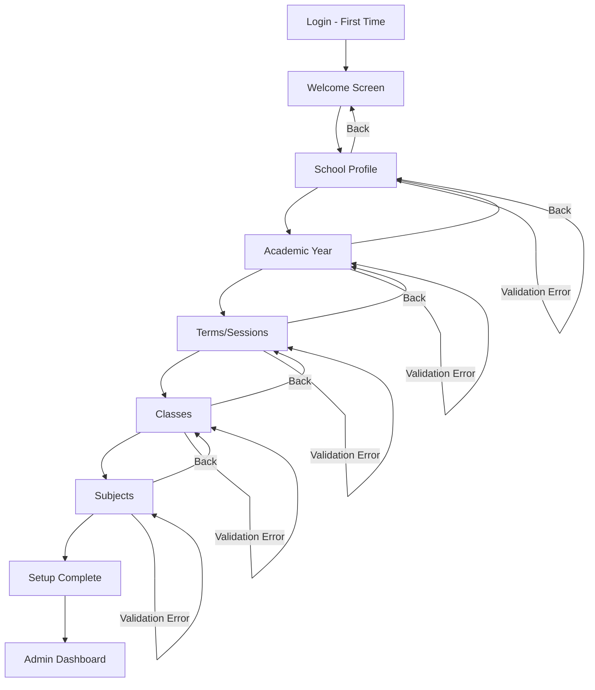
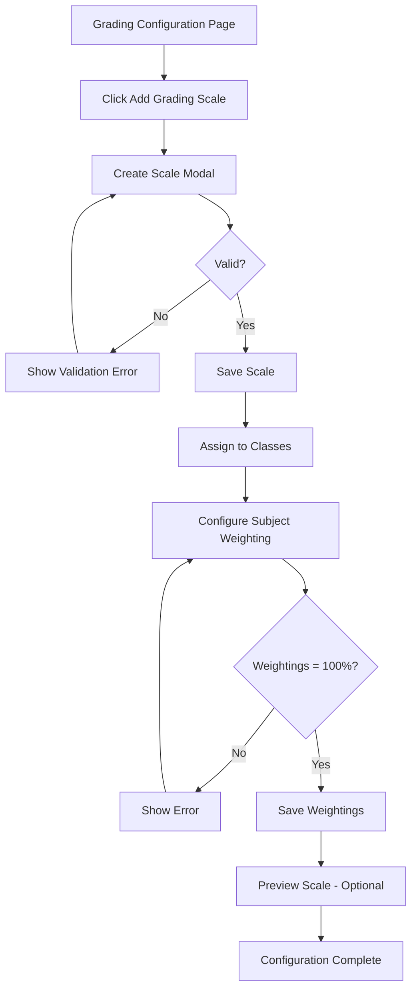
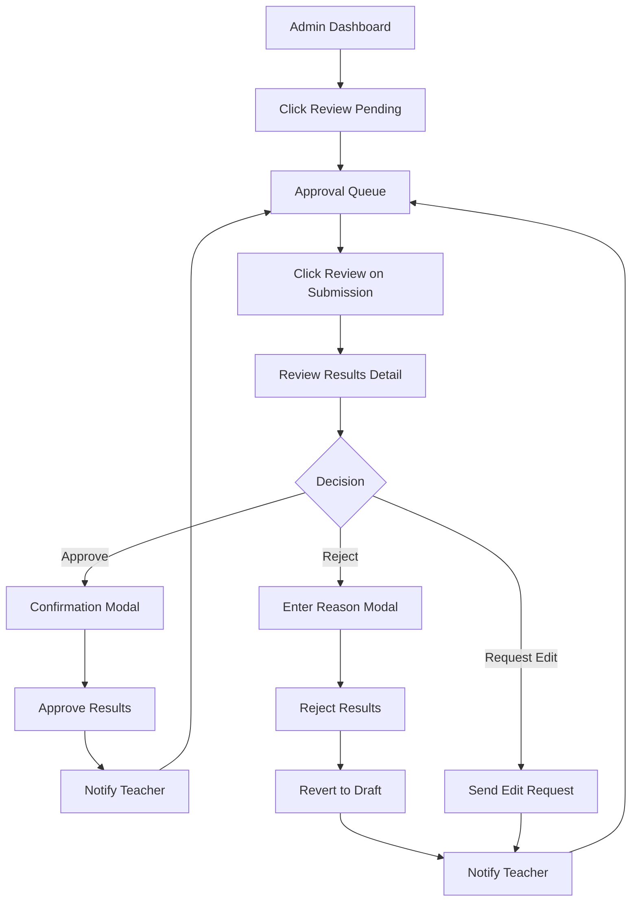
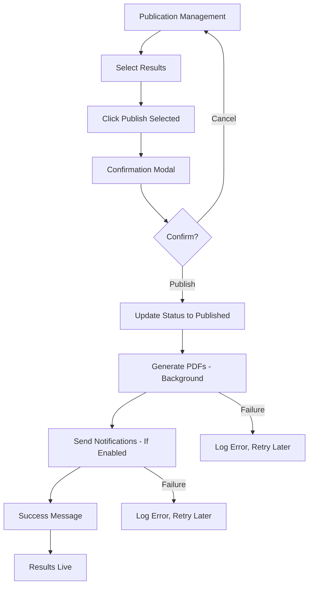
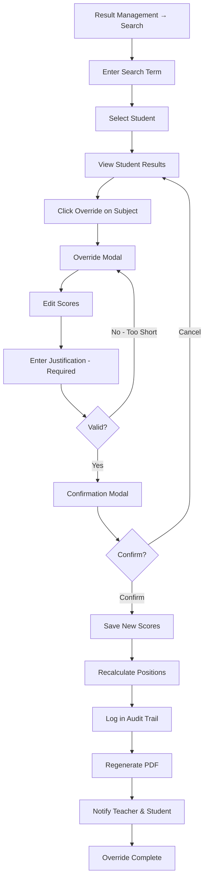
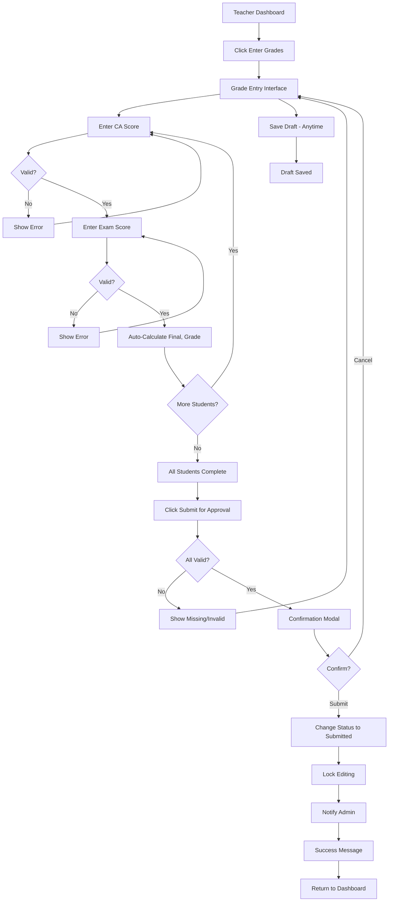
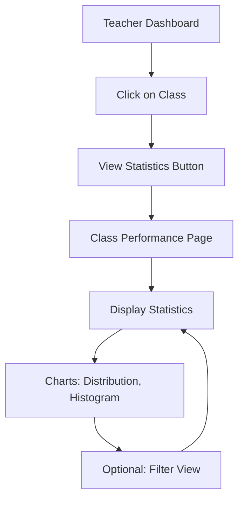
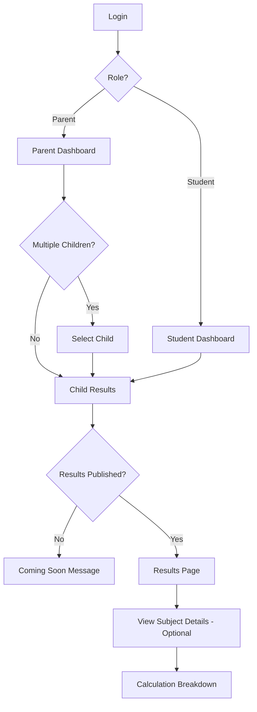
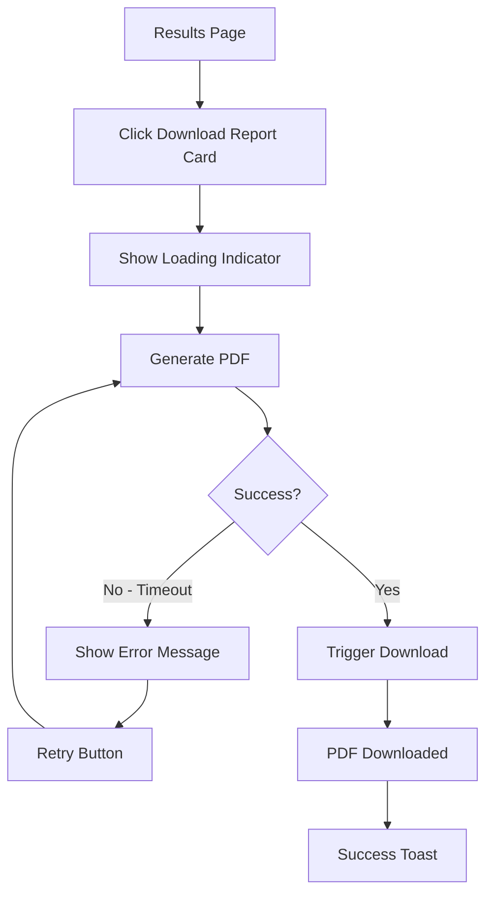
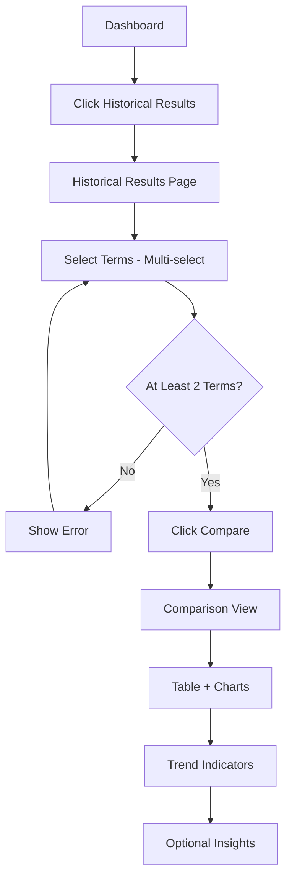

# User Flows
# School Result Management System (SRMS)

**Version:** 1.0  
**Date:** 2026-01-05  
**Owner:** UX Designer

---

## Overview

This document defines all critical user flows for the SRMS, mapped from the PRD requirements. Each flow includes entry points, steps, success states, and alternative paths.

---

## Flow Categories

1. **Administrator Flows** (5 flows)
2. **Teacher Flows** (3 flows)
3. **Student/Parent Flows** (3 flows)

**Total:** 11 critical user flows

---

## 1. Administrator Flows

### Flow 1: First-Time School Setup

**Related Requirements:** FR-011 to FR-016  
**User Persona:** Administrator  
**Goal:** Configure school profile and basic settings for first use

**Entry Point:** Admin logs in for first time after account creation

**Flow Steps:**

1. **Welcome Screen**
   - System detects incomplete setup
   - Shows setup wizard welcome message
   - Button: "Start Setup"
   - User clicks "Start Setup"

2. **School Profile (Step 1 of 5)**
   - Form fields: School name, logo upload, address, phone, email, website
   - User enters school details
   - User uploads school logo (optional)
   - Button: "Next"
   - System validates required fields
   - System saves school profile

3. **Academic Year (Step 2 of 5)**
   - User creates academic year (e.g., "2025-2026")
   - User enters start date and end date
   - User marks as "Active"
   - Button: "Next"
   - System validates dates (start < end)
   - System creates academic year

4. **Terms/Sessions (Step 3 of 5)**
   - User creates terms within academic year
   - For each term: Name, start date, end date
   - Example: Term 1 (Sept-Dec), Term 2 (Jan-Apr), Term 3 (May-July)
   - User marks one term as "Active"
   - Button: "Next"
   - System validates term dates (no overlap, within academic year)
   - System creates terms

5. **Classes (Step 4 of 5)**
   - User creates classes (e.g., Grade 7A, Grade 8B)
   - For each class: Name, grade level
   - User can add multiple classes
   - Button: "Next"
   - System creates classes

6. **Subjects (Step 5 of 5)**
   - User creates subjects (e.g., Mathematics, English, Science)
   - For each subject: Name, default weighting (CA %, Exam %)
   - User assigns subjects to classes
   - Button: "Finish Setup"
   - System validates total weighting = 100%
   - System creates subjects

7. **Setup Complete**
   - System shows success message
   - Shows checklist of completed steps
   - Button: "Go to Dashboard"
   - System redirects to Admin Dashboard

**Success State:** School is configured and ready for use

**Alternative Paths:**
- User clicks "Skip" on any step → System warns about incomplete setup
- User clicks "Back" → Returns to previous step with saved data
- Validation error → Shows inline error, prevents navigation

**Flow Diagram:**

---

### Flow 2: Configure Grading Scales

**Related Requirements:** FR-021, FR-022, FR-023  
**User Persona:** Administrator  
**Goal:** Set up grading scales and subject weighting for the school

**Entry Point:** Admin navigates to School Settings → Grading Configuration

**Flow Steps:**

1. **Grading Configuration Page**
   - Shows existing grading scales (if any)
   - Button: "Add Grading Scale"
   - User clicks "Add Grading Scale"

2. **Create Grading Scale Modal**
   - Form field: Scale name (e.g., "Standard Scale", "Science Scale")
   - Grade boundary table:
     - Grade A: Min 75, Max 100
     - Grade B: Min 70, Max 74
     - Grade C: Min 65, Max 69
     - Grade D: Min 60, Max 64
     - Grade F: Min 0, Max 59
   - User can add/remove/edit grade rows
   - Button: "Save Scale"
   - System validates:
     - No gaps (every score 0-100 covered)
     - No overlaps
     - Min < Max for each grade
   - System saves grading scale

3. **Assign Scale to Departments/Classes**
   - User selects which classes/departments use this scale
   - Default: "School-wide" (all classes)
   - OR: Specific classes (e.g., Science classes use different scale)
   - Button: "Apply"
   - System assigns scale to selected classes

4. **Configure Subject Weighting**
   - User navigates to "Subject Weighting" tab
   - Shows list of subjects
   - For each subject, user sets:
     - CA Weight % (e.g., 30%)
     - Exam Weight % (e.g., 70%)
   - System validates total = 100%
   - Button: "Save Weightings"
   - System saves subject weightings

5. **Preview Grading Scale**
   - User can test grading scale with sample scores
   - Input: Score (e.g., 85)
   - System shows: Letter Grade (A)
   - Helps verify scale is correct

**Success State:** Grading scales and weightings configured

**Alternative Paths:**
- Validation error (gaps/overlaps) → Shows error, highlights problem grades
- User cancels → Returns to grading config page without saving
- User edits existing scale → Shows edit modal with current values

**Flow Diagram:**

---

### Flow 3: Review and Approve Submitted Results

**Related Requirements:** FR-076, FR-077  
**User Persona:** Administrator  
**Goal:** Review teacher-submitted results and approve for publication

**Entry Point:** Admin dashboard shows pending approvals notification

**Flow Steps:**

1. **Admin Dashboard**
   - Shows widget: "Pending Approvals: X classes"
   - User clicks "Review Pending Results"
   - System navigates to Approval Queue

2. **Approval Queue Page**
   - Shows table of pending submissions:
     - Class, Subject, Teacher, Date Submitted, Students Count
   - Each row has action buttons: "Review", "Approve", "Reject"
   - User clicks "Review" on a submission

3. **Review Results Detail**
   - Shows all student grades in table:
     - Student Name, CA Score, Exam Score, Final Score, Grade, Position
   - Shows class statistics:
     - Highest, Lowest, Average, Grade Distribution
   - User can spot-check individual grades
   - User can view calculation details (click to expand)
   - Buttons: "Approve", "Reject", "Request Edit"

4. **Admin Decision: Approve**
   - User clicks "Approve"
   - System shows confirmation modal: "Approve results for [Class] - [Subject]?"
   - User confirms
   - System updates status to "Approved"
   - System notifies teacher via email/notification
   - System returns to Approval Queue

5. **Admin Decision: Reject**
   - User clicks "Reject"
   - System shows modal: "Reason for rejection?" (required text field)
   - User enters reason (e.g., "Missing scores for 3 students")
   - User clicks "Reject"
   - System reverts grades to "Draft" status
   - System sends rejection reason to teacher
   - System returns to Approval Queue

6. **Bulk Approval (Alternative)**
   - User selects multiple submissions (checkboxes)
   - User clicks "Approve Selected"
   - System shows confirmation: "Approve X submissions?"
   - User confirms
   - System approves all selected submissions
   - System sends notifications to all teachers

**Success State:** Results approved and ready for publication

**Alternative Paths:**
- No pending approvals → Shows empty state: "All caught up!"
- User requests edit → Teacher can modify and re-submit
- Network error during approval → Shows error, allows retry

**Flow Diagram:**

---

### Flow 4: Publish Results to Students/Parents

**Related Requirements:** FR-077  
**User Persona:** Administrator  
**Goal:** Make approved results visible to students and parents

**Entry Point:** Admin navigates to Publication Management

**Flow Steps:**

1. **Publication Management Page**
   - Shows approved but unpublished results
   - Filter by: Term, Class, Subject
   - Table columns: Class, Subject, Approved Date, Students Count
   - Selection checkboxes for each row
   - Button: "Publish Selected"

2. **Select Results to Publish**
   - User selects specific results (checkboxes)
   - OR: Select "Publish All for Term 1"
   - Button: "Publish Selected" becomes active
   - User clicks "Publish Selected"

3. **Publication Confirmation**
   - Modal shows: "Publish results for X classes?"
   - Warning: "Students and parents will be able to view these results immediately"
   - Option: "Send email notifications" (checkbox, default checked)
   - Buttons: "Cancel", "Publish"
   - User clicks "Publish"

4. **Publishing Process**
   - System shows progress indicator
   - System updates result status to "Published"
   - System generates PDF report cards (background job)
   - System sends email notifications (if enabled)
   - Shows success message: "Results published successfully for X classes"

5. **Publication Complete**
   - Results immediately visible to students/parents
   - Published results move to "Published Results" tab
   - System logs publication (who, when)

**Success State:** Results are live and accessible to students/parents

**Alternative Paths:**
- User un-publishes results → Confirmation required, results hidden from students
- PDF generation fails → Results still visible, PDFs generated later
- Email sending fails → Results published, emails retried

**Flow Diagram:**

---

### Flow 5: Override Incorrect Result (Post-Publication)

**Related Requirements:** FR-078  
**User Persona:** Administrator  
**Goal:** Correct an error in published results with justification

**Entry Point:** Admin discovers error in published results

**Flow Steps:**

1. **Search for Student Result**
   - Admin navigates to Result Management → Search
   - Search by: Student name, Student ID, Class
   - User enters search term
   - System shows matching students

2. **Select Student**
   - User clicks on student from search results
   - System shows all results for student (all subjects, current term)

3. **Locate Incorrect Result**
   - User identifies incorrect subject result
   - User clicks "Override" button next to result

4. **Override Modal**
   - Shows current values: CA Score, Exam Score, Final Score, Grade, Position
   - User edits incorrect score(s)
   - System auto-calculates new Final Score, Grade (real-time preview)
   - Required field: "Justification" (50-500 characters)
   - Example: "Data entry error - exam score should be 85, not 58"
   - User enters justification
   - Button: "Save Override"

5. **Confirmation**
   - System shows confirmation: "Override result for [Student] in [Subject]?"
   - Shows: Old values → New values
   - User confirms

6. **Override Processing**
   - System saves new scores
   - System recalculates affected values:
     - Student's final score, grade
     - All students' positions in that class/subject (if position changed)
     - Overall position (if affected)
   - System logs override in audit trail:
     - Admin who made change
     - Timestamp
     - Old values
     - New values
     - Justification
   - System regenerates student's PDF report card
   - System sends notification to:
     - Teacher who entered original grade
     - Student (if significant change)

7. **Override Complete**
   - Success message: "Result updated successfully"
   - Updated result immediately visible to student/parent
   - Audit log entry created

**Success State:** Error corrected, audit trail logged, stakeholders notified

**Alternative Paths:**
- Justification too short → Validation error, must be 50+ chars
- Network error → Shows error, allows retry
- User cancels → No changes made

**Flow Diagram:**

---

## 2. Teacher Flows

### Flow 6: Enter Grades for a Class (Primary Use Case)

**Related Requirements:** FR-031, FR-032, FR-033  
**User Persona:** Teacher  
**Goal:** Enter CA and Exam scores for all students in assigned class

**Entry Point:** Teacher dashboard shows assigned classes

**Flow Steps:**

1. **Teacher Dashboard**
   - Shows assigned class-subject combinations
   - Example: "Grade 7A Mathematics", "Grade 7B Mathematics"
   - Each card shows: Class, Subject, Progress (X/Y students graded)
   - Button on each card: "Enter Grades"
   - User clicks "Enter Grades" on a class

2. **Grade Entry Interface**
   - Shows table with columns:
     - Student Name, CA Score, Exam Score, Final Score, Grade, Position
   - Student roster auto-populated (from enrollment)
   - Subject weighting displayed: "CA: 30%, Exam: 70%"
   - Grading scale displayed: "A: 75-100, B: 70-74, etc."
   - All CA and Exam fields empty (or show draft values if previously saved)

3. **Enter Scores (User Input)**
   - User enters CA score for first student (e.g., 85)
   - Field validates: Must be 0-100, up to 2 decimal places
   - User presses Tab to move to Exam score field
   - User enters Exam score (e.g., 90)
   - System auto-calculates in real-time:
     - Final Score: (85 × 0.30) + (90 × 0.70) = 88.5
     - Letter Grade: B (based on grading scale)
     - Position: Calculated after all students entered
   - User continues entering scores for all students
   - Progress indicator: "25 of 40 students completed"

4. **Real-Time Validation**
   - Invalid score (e.g., 105) → Shows red border, error message: "Score must be 0-100"
   - Non-numeric (e.g., "abc") → Shows error: "Must be a number"
   - Missing required score → Highlighted in yellow when user tries to submit
   - User corrects errors

5. **Save as Draft (Optional)**
   - User can click "Save Draft" at any time
   - System saves current state
   - Status: "Draft" (teacher can edit later)
   - User can close page and return later
   - Success toast: "Draft saved"

6. **Submit for Approval**
   - User completes all students
   - User clicks "Submit for Approval"
   - System validates:
     - All students have both CA and Exam scores
     - All scores are valid (0-100)
   - If invalid: Shows errors, prevents submission
   - If valid: Shows confirmation modal

7. **Confirmation Modal**
   - Modal: "Submit results for [Class] - [Subject] for approval?"
   - Shows: X students, Average: Y, Grade distribution
   - Warning: "You won't be able to edit after submission (unless admin approves edit request)"
   - Buttons: "Cancel", "Submit"
   - User clicks "Submit"

8. **Submission Success**
   - System changes status to "Submitted - Pending Approval"
   - System locks grades from teacher editing
   - System sends grades to Admin approval queue
   - System notifies admin
   - Success message: "Results submitted successfully"
   - User redirected to Teacher Dashboard
   - Submitted class now shows: "Status: Pending Approval"

**Success State:** Grades submitted and awaiting admin approval

**Alternative Paths:**
- User clicks "Save Draft" → Saves progress, can edit later
- Validation errors → Highlights errors, prevents submission
- User wants to edit submitted grades → Must request edit from admin
- Network error during submit → Shows error, allows retry, data preserved
- Auto-save failure → User notified to save manually

**Flow Diagram:**

---

### Flow 7: Submit Grades for Approval

**Related Requirements:** FR-033  
**User Persona:** Teacher  
**Goal:** Finalize draft grades and submit to admin

(This flow is integrated into Flow 6 above - see steps 6-8)

---

### Flow 8: View Class Performance Statistics

**Related Requirements:** FR-039  
**User Persona:** Teacher  
**Goal:** Understand how the class performed overall

**Entry Point:** Teacher views submitted/approved results for a class

**Flow Steps:**

1. **Teacher Dashboard**
   - User clicks on a submitted/approved class
   - System shows "View Statistics" button
   - User clicks "View Statistics"

2. **Class Performance Page**
   - Shows class-subject result summary
   - Statistics displayed:
     - **Overall:** Highest score, Lowest score, Class average, Pass rate
     - **Grade Distribution:** Bar chart (A: X students, B: Y students, etc.)
     - **Score Distribution:** Histogram showing score ranges
     - **Position List:** Top 10 students (anonymized for privacy if needed)
   - Charts update based on submitted grades

3. **Filter Options (Optional)**
   - Filter by: CA scores only, Exam scores only, Final scores
   - Charts update in real-time

**Success State:** Teacher understands class performance

**Flow Diagram:**

---

## 3. Student/Parent Flows

### Flow 9: View Current Results

**Related Requirements:** FR-066, FR-067  
**User Persona:** Student or Parent  
**Goal:** Access current term academic results

**Entry Point:** Student/Parent logs in

**Flow Steps:**

1. **Login Page**
   - User enters email and password
   - User clicks "Login"
   - System validates credentials
   - System redirects based on role:
     - Student → Student Dashboard
     - Parent → Parent Dashboard

2. **Student Dashboard** (Student view)
   - Shows current term results card
   - If results published: Shows "View Results" button
   - If results not published: Shows "Results coming soon"
   - User clicks "View Results"

3. **Parent Dashboard** (Parent view - if multiple children)
   - Shows list of linked children
   - User selects child
   - Shows child's results

4. **Results Page**
   - Shows current term results table:
     - Subject, CA Score, Exam Score, Final Score, Grade, Position
   - Shows overall summary:
     - Total Score, Average, Overall Position
     - Grade Distribution (my grades)
   - Shows class statistics:
     - Class Average, Highest in Class, Lowest in Class
   - Professional, clean design

5. **Result Details (Optional)**
   - User clicks on a subject row
   - Expands to show:
     - Calculation breakdown: "(CA 85 × 30%) + (Exam 90 × 70%) = 88.5"
     - Position context: "5th out of 40 students"
     - Grading scale used

**Success State:** User views their current results

**Alternative Paths:**
- Results not published → Shows "Results coming soon" message
- Parent with multiple children → Select child from dropdown
- Network error → Shows offline message, offers retry

**Flow Diagram:**

---

### Flow 10: Download PDF Report Card

**Related Requirements:** FR-056  
**User Persona:** Student or Parent  
**Goal:** Download printable report card

**Entry Point:** User viewing results page

**Flow Steps:**

1. **Results Page**
   - Shows all results for current term
   - Button: "Download Report Card" (top right)
   - User clicks "Download Report Card"

2. **PDF Generation**
   - System shows loading indicator: "Generating your report card..."
   - System generates PDF with:
     - School logo and header
     - Student details (name, class, term)
     - All subject results (CA, Exam, Final, Grade, Position)
     - Overall summary (Total, Average, Overall Position)
     - Class teacher signature block
     - Date of generation
   - Professional formatting, print-ready
   - File name: "[StudentName]_Term1_ReportCard.pdf"

3. **Download**
   - System triggers browser download
   - PDF downloads to user's device
   - Success toast: "Report card downloaded successfully"
   - User can view/print PDF

**Success State:** Report card PDF downloaded

**Alternative Paths:**
- PDF generation timeout → Shows error: "Generation taking longer than expected, please try again"
- Network error → Shows error, allows retry
- Browser blocks download → Shows message to allow downloads

**Flow Diagram:**

---

### Flow 11: Compare Results Across Terms (P1 Feature)

**Related Requirements:** FR-068  
**User Persona:** Student or Parent  
**Goal:** See performance trends over multiple terms

**Entry Point:** User navigates to Historical Results

**Flow Steps:**

1. **Dashboard**
   - Navigation link: "Historical Results" or "Performance Trends"
   - User clicks link

2. **Historical Results Page**
   - Shows dropdown: Select terms to compare (multi-select)
   - User selects: Term 1, Term 2, Term 3
   - Button: "Compare"
   - User clicks "Compare"

3. **Comparison View**
   - Shows table:
     - Subject | Term 1 | Term 2 | Term 3 | Trend
     - Mathematics | 85 (B) | 88 (B) | 91 (A) | ↑ Improved
     - English | 78 (B) | 75 (B) | 73 (C) | ↓ Declined
   - Shows trend line chart for each subject
   - Shows overall average trend
   - Visual indicators:
     - Green arrow up (improved)
     - Red arrow down (declined)
     - Yellow dash (same)

4. **Insights (Optional)**
   - System highlights:
     - "Best improvement: Mathematics (+6 points)"
     - "Needs attention: English (-5 points)"
     - "Overall trend: Improving (+3 points average)"

**Success State:** User sees performance trends

**Alternative Paths:**
- Only 1 term available → Shows message: "At least 2 terms required for comparison"
- User selects same term twice → Validation error

**Flow Diagram:**

---

## Flow Summary

**Total Flows:** 11

### By User Role:
- **Administrator:** 5 flows
- **Teacher:** 3 flows
- **Student/Parent:** 3 flows

### By Priority:
- **P0 (MVP Critical):** 9 flows
- **P1 (Post-MVP):** 2 flows (Override results, Compare terms)

### Flow Complexity:
- **Simple (3-5 steps):** 4 flows
- **Medium (6-10 steps):** 5 flows
- **Complex (11+ steps):** 2 flows (First-time setup, Grade entry)

---

## Next Steps

These user flows will guide:
1. **Interaction design** (interaction-specs.md)
2. **Mockup creation** (mockups/)
3. **Edge case handling** (edge-cases.md)
4. **Accessibility requirements** (accessibility.md)
5. **Technical architecture** (Stage 6)

---

**Document Status:** Complete  
**Owner:** UX Designer  
**Last Updated:** 2026-01-05
