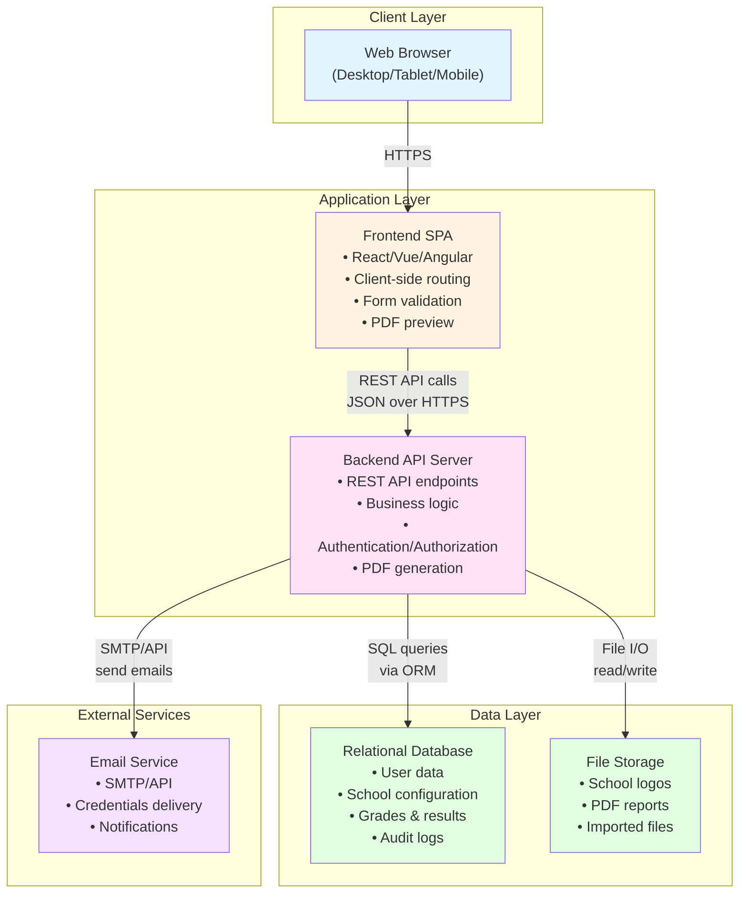
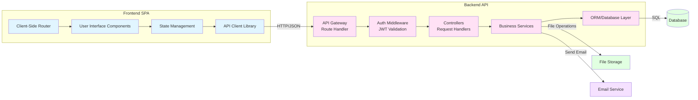
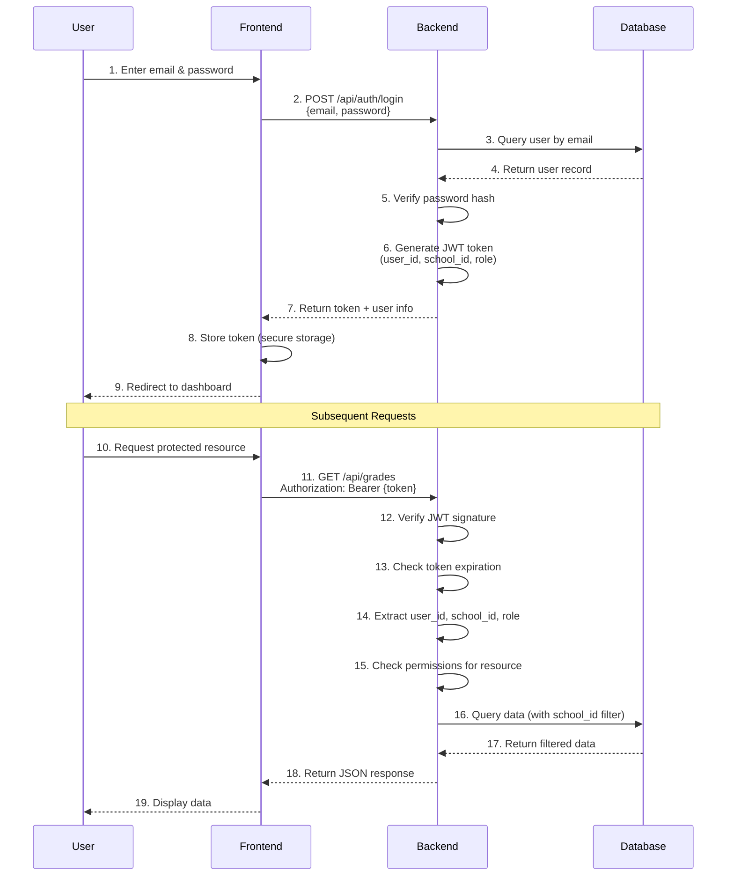
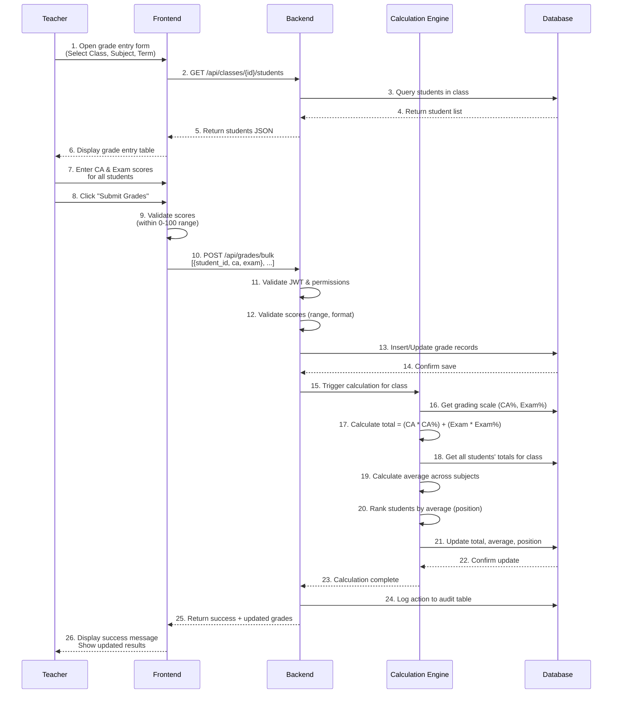
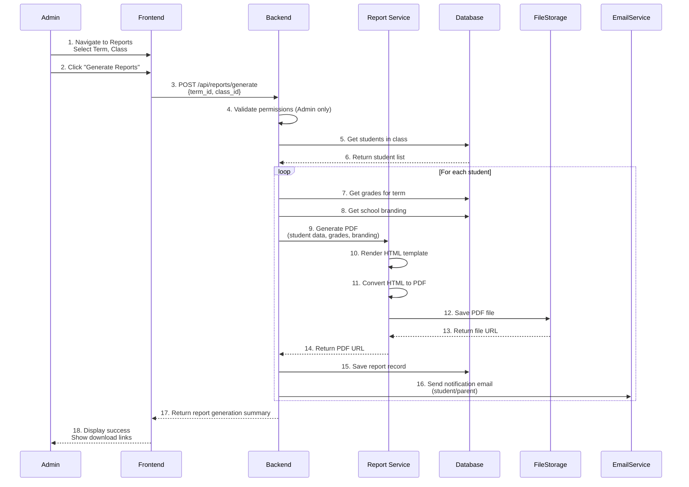
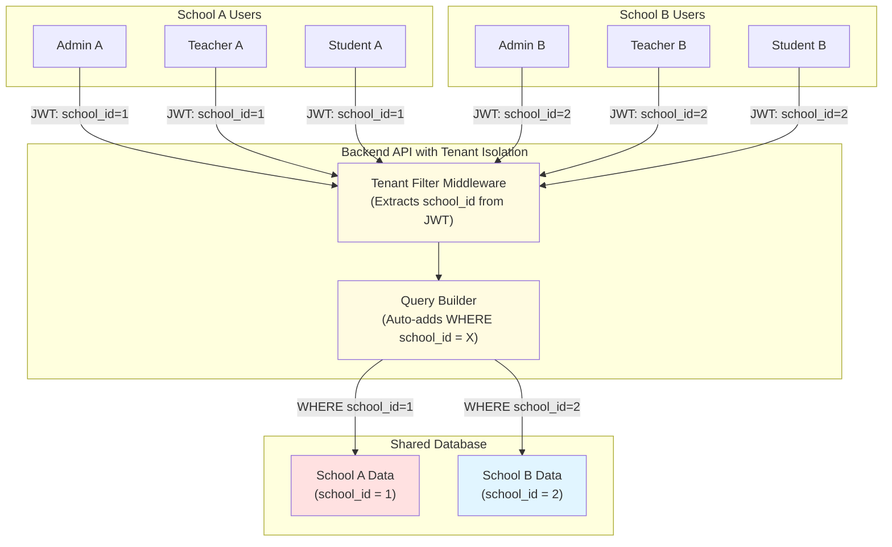
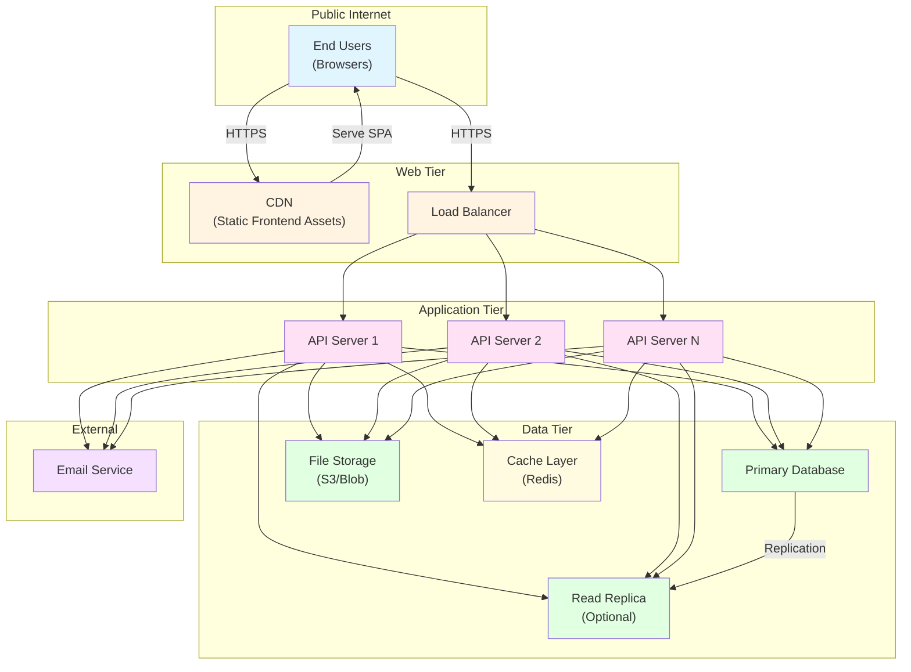
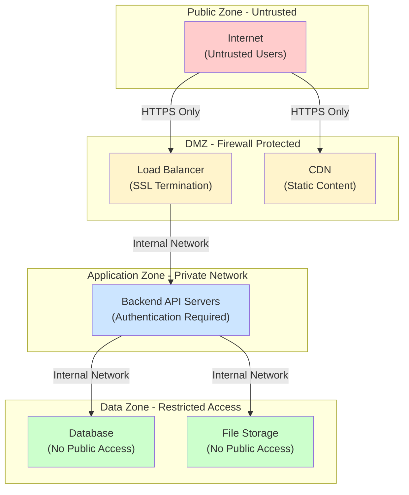
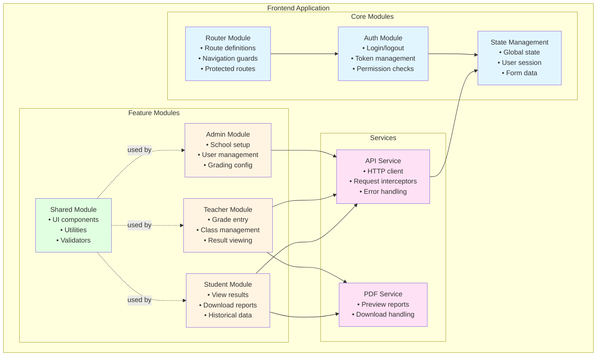
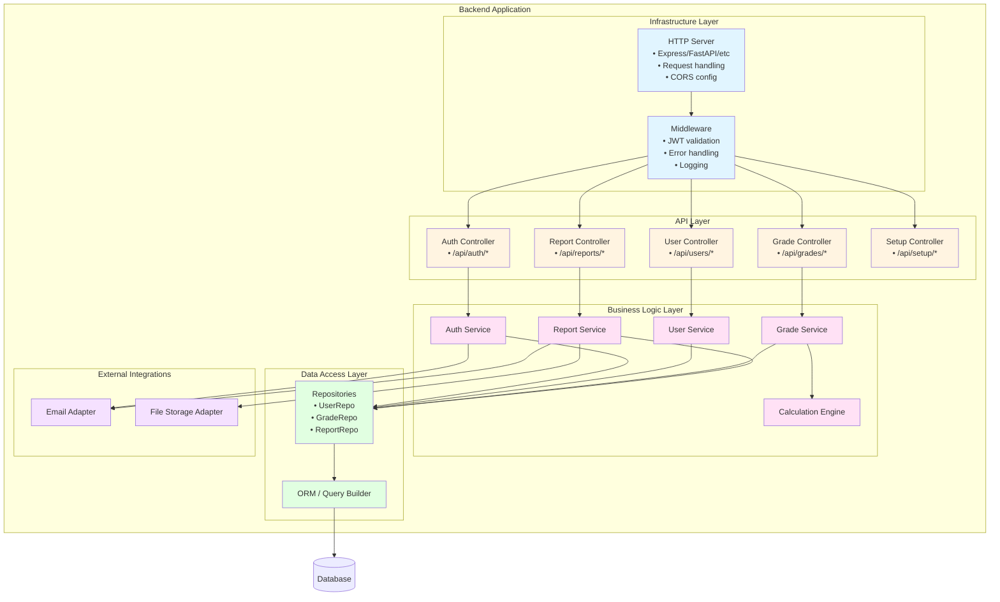

# Architecture Diagram
# School Result Management System (SRMS)

**Version:** 1.0  
**Date:** 2026-01-11  
**Owner:** Software Architect  
**Status:** Draft

---

## 1. High-Level System Architecture



---

## 2. Component Architecture



---

## 3. Data Architecture

```mermaid
erDiagram
    SCHOOL ||--o{ USER : has
    SCHOOL ||--o{ ACADEMIC_YEAR : defines
    SCHOOL ||--o{ GRADING_SCALE : configures
    
    ACADEMIC_YEAR ||--o{ TERM : contains
    SCHOOL ||--o{ CLASS : has
    SCHOOL ||--o{ SUBJECT : offers
    
    CLASS ||--o{ STUDENT_CLASS : enrollment
    USER ||--o{ STUDENT_CLASS : enrolled_in
    
    SUBJECT ||--o{ CLASS_SUBJECT : taught_in
    CLASS ||--o{ CLASS_SUBJECT : teaches
    
    USER ||--o{ GRADE : receives
    CLASS_SUBJECT ||--o{ GRADE : for
    TERM ||--o{ GRADE : during
    
    USER ||--o{ REPORT : generated_for
    TERM ||--o{ REPORT : in
    
    USER ||--o{ AUDIT_LOG : performs
    USER ||--o{ PARENT_STUDENT : parent_link
    USER ||--o{ PARENT_STUDENT : child_link
    
    SCHOOL {
        int id PK
        string name
        string logo_url
        string address
        string email
    }
    
    USER {
        int id PK
        int school_id FK
        string email
        string password_hash
        string role
        string full_name
    }
    
    ACADEMIC_YEAR {
        int id PK
        int school_id FK
        string name
        date start_date
        date end_date
        boolean is_active
    }
    
    TERM {
        int id PK
        int academic_year_id FK
        string name
        date start_date
        date end_date
        boolean is_active
    }
    
    CLASS {
        int id PK
        int school_id FK
        string name
        int grade_level
    }
    
    SUBJECT {
        int id PK
        int school_id FK
        string name
    }
    
    GRADING_SCALE {
        int id PK
        int school_id FK
        int subject_id FK
        int ca_percentage
        int exam_percentage
    }
    
    GRADE {
        int id PK
        int student_id FK
        int class_subject_id FK
        int term_id FK
        decimal ca_score
        decimal exam_score
        decimal total_score
        decimal average
        int position
        boolean is_locked
    }
    
    REPORT {
        int id PK
        int student_id FK
        int term_id FK
        string pdf_url
        datetime generated_at
    }
    
    AUDIT_LOG {
        int id PK
        int user_id FK
        string action
        string entity_type
        int entity_id
        text old_value
        text new_value
        datetime timestamp
    }
```

---

## 4. Authentication & Authorization Flow



---

## 5. Grade Entry & Calculation Flow



---

## 6. Report Generation Flow



---

## 7. Multi-Tenancy Isolation



---

## 8. Deployment Architecture (High-Level)



---

## 9. Security Zones



---

## 10. Module Diagram - Frontend SPA



---

## 11. Module Diagram - Backend API



---

## 12. Summary

This architecture provides:

✅ **Clear separation of concerns** - Frontend, Backend, Database  
✅ **Scalability** - Stateless API, horizontal scaling  
✅ **Security** - JWT auth, RBAC, data encryption, tenant isolation  
✅ **Maintainability** - Modular design, clear interfaces  
✅ **Performance** - Caching, database optimization, async operations  
✅ **Reliability** - Error handling, audit logs, backups  

---

**Next Steps:**
1. Review and approve architecture diagrams
2. Document detailed data flow scenarios
3. Define deployment boundaries and environments
4. Proceed to Stage 7: Technical Specifications

---

**Status:** Ready for Review  
**Approver:** Product Owner, Technical Lead  
**Last Updated:** 2026-01-11
