# Data Flow
# School Result Management System (SRMS)

**Version:** 1.0  
**Date:** 2026-01-11  
**Owner:** Software Architect  
**Status:** Draft

---

## Overview

This document details how data flows through the SRMS across different user interactions and system processes. Each flow includes request-response patterns, data transformations, and system state changes.

---

## 1. User Authentication Flow

### 1.1 Login Flow

**Actors:** User (any role), Frontend, Backend, Database

**Flow:**

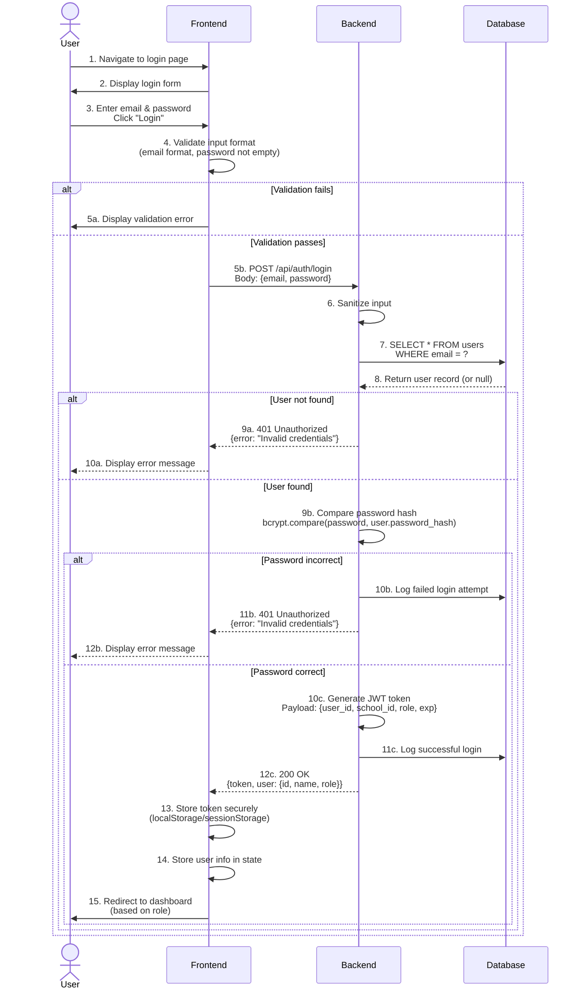

**Data Transformations:**

| Stage | Data Input | Data Output |
|-------|------------|-------------|
| **Client Input** | Email (string), Password (string) | - |
| **Frontend Validation** | Raw input | Validated email, password |
| **API Request** | {email, password} | JSON payload |
| **Backend Processing** | {email, password} | Password hash comparison |
| **Token Generation** | user_id, school_id, role | JWT token (encrypted) |
| **API Response** | JWT + user object | {token, user: {...}} |
| **Client Storage** | Token + user data | Stored in localStorage |

---

### 1.2 Authenticated Request Flow

**Every subsequent request after login**

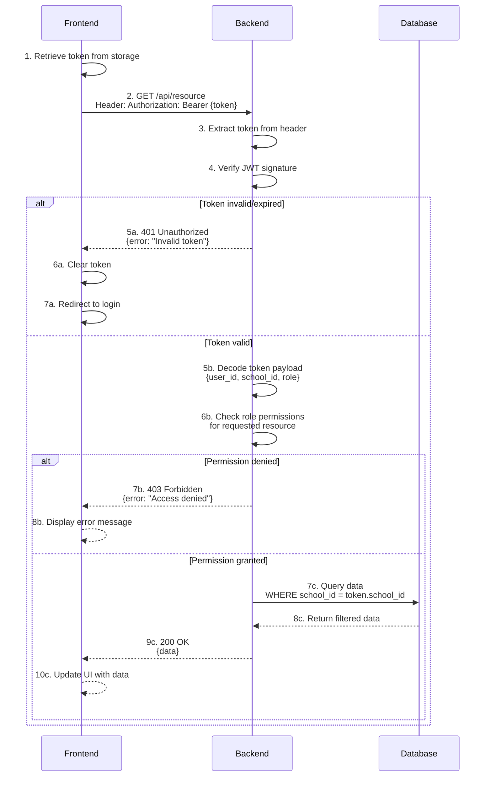

**Security Mechanisms:**

1. **JWT Signature Verification** - Ensures token hasn't been tampered with
2. **Expiration Check** - Tokens expire after 4 hours
3. **Tenant Isolation** - `school_id` from token filters all queries
4. **Role-Based Access** - Middleware checks role before processing request

---

## 2. School Setup Flow (First-Time Configuration)

### 2.1 Complete Setup Flow

**Actor:** Administrator (first login)

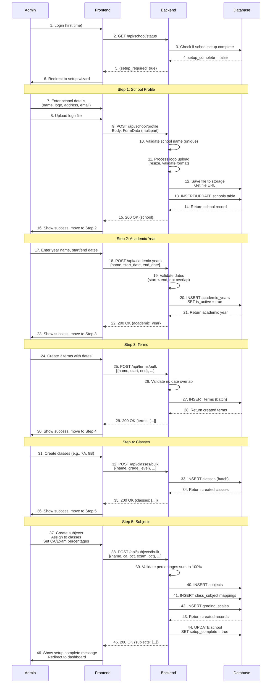

**Data Created:**

| Entity | Example Data |
|--------|-------------|
| **School** | {id: 1, name: "Green Valley High", logo_url: "/uploads/logo.png", setup_complete: true} |
| **Academic Year** | {id: 1, school_id: 1, name: "2025-2026", start_date: "2025-09-01", end_date: "2026-06-30", is_active: true} |
| **Terms** | [{id: 1, academic_year_id: 1, name: "Term 1", start_date: "2025-09-01", end_date: "2025-12-15", is_active: true}, ...] |
| **Classes** | [{id: 1, school_id: 1, name: "Grade 7A", grade_level: 7}, ...] |
| **Subjects** | [{id: 1, school_id: 1, name: "Mathematics"}, {id: 2, school_id: 1, name: "English"}, ...] |
| **Class-Subject** | [{class_id: 1, subject_id: 1}, {class_id: 1, subject_id: 2}, ...] |
| **Grading Scales** | [{subject_id: 1, ca_percentage: 40, exam_percentage: 60}, ...] |

---

## 3. Grade Entry Flow

### 3.1 Teacher Enters Grades for a Class

**Actor:** Teacher

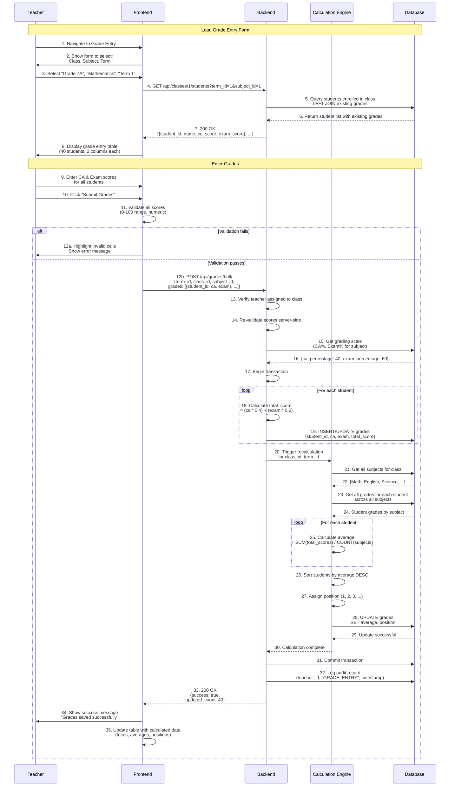

**Data Transformations:**

| Stage | Input | Processing | Output |
|-------|-------|------------|--------|
| **Teacher Input** | CA: 85, Exam: 78 | - | Raw scores |
| **Validation** | Raw scores | Check 0-100 range | Valid scores |
| **Total Calculation** | CA: 85, Exam: 78, Scale: (40%, 60%) | (85 × 0.4) + (78 × 0.6) | Total: 80.8 |
| **Average Calculation** | Math: 80.8, English: 75, Science: 82 | (80.8 + 75 + 82) / 3 | Average: 79.27 |
| **Position Calculation** | All students' averages | Sort DESC, assign rank | Position: 5 |
| **Database Storage** | Calculated values | Persist to DB | Saved grades |

---

### 3.2 Grade Modification (Admin Override)

**Actor:** Administrator

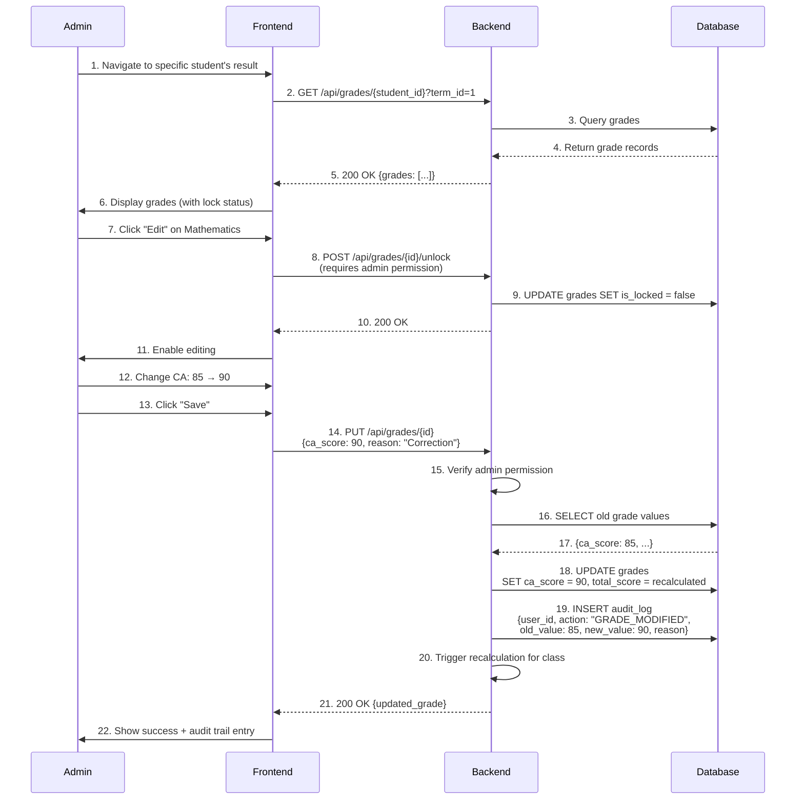

**Audit Trail Data:**

```json
{
  "id": 1234,
  "user_id": 5,
  "user_name": "Admin John",
  "action": "GRADE_MODIFIED",
  "entity_type": "grade",
  "entity_id": 789,
  "old_value": "{\"ca_score\": 85, \"total_score\": 80.8}",
  "new_value": "{\"ca_score\": 90, \"total_score\": 83.8}",
  "reason": "Correction after exam re-marking",
  "timestamp": "2026-01-11T10:30:00Z"
}
```

---

## 4. Report Card Generation Flow

### 4.1 Bulk Report Generation for a Class

**Actor:** Administrator

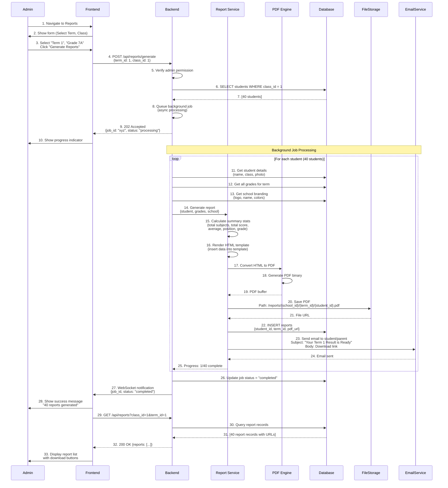

**Report Data Structure:**

```json
{
  "report_id": 123,
  "student": {
    "id": 456,
    "name": "John Doe",
    "class": "Grade 7A",
    "photo_url": "/uploads/students/456.jpg"
  },
  "school": {
    "name": "Green Valley High School",
    "logo_url": "/uploads/logo.png",
    "address": "123 Main St, City",
    "term": "Term 1 (2025-2026)"
  },
  "grades": [
    {"subject": "Mathematics", "ca": 85, "exam": 78, "total": 80.8, "grade": "B"},
    {"subject": "English", "ca": 80, "exam": 70, "total": 74.0, "grade": "C"},
    {"subject": "Science", "ca": 90, "exam": 88, "total": 88.8, "grade": "A"}
  ],
  "summary": {
    "total_subjects": 10,
    "total_score": 792,
    "average": 79.2,
    "position": 5,
    "out_of": 40,
    "overall_grade": "B"
  },
  "pdf_url": "/reports/1/1/456.pdf",
  "generated_at": "2026-01-11T11:00:00Z"
}
```

---

## 5. Result Viewing Flow (Student/Parent)

### 5.1 Student Views Own Results

**Actor:** Student

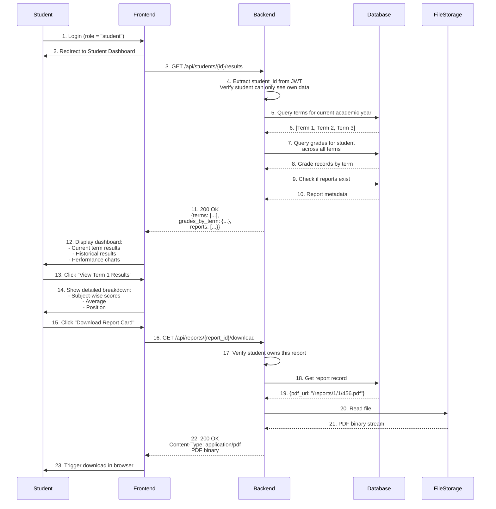

---

### 5.2 Parent Views Multiple Children's Results

**Actor:** Parent

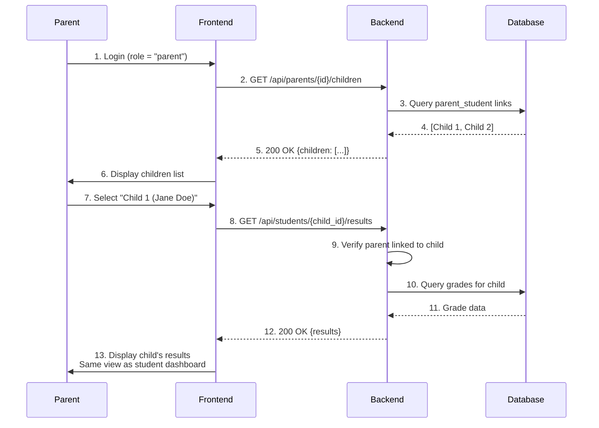

---

## 6. Historical Data & Trend Analysis

### 6.1 View Student Progress Across Terms

**Actor:** Teacher/Admin

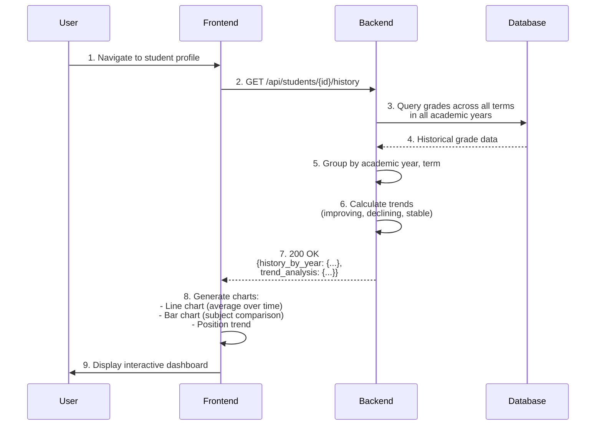

**Historical Data Example:**

```json
{
  "student_id": 456,
  "history": [
    {
      "academic_year": "2024-2025",
      "terms": [
        {"term": "Term 1", "average": 75.5, "position": 8},
        {"term": "Term 2", "average": 78.2, "position": 6},
        {"term": "Term 3", "average": 80.1, "position": 5}
      ]
    },
    {
      "academic_year": "2025-2026",
      "terms": [
        {"term": "Term 1", "average": 79.2, "position": 5}
      ]
    }
  ],
  "trend": {
    "direction": "improving",
    "average_change": "+3.7 points",
    "position_change": "Improved by 3 ranks"
  }
}
```

---

## 7. Data Validation & Error Handling Flow

### 7.1 Invalid Grade Entry Handling

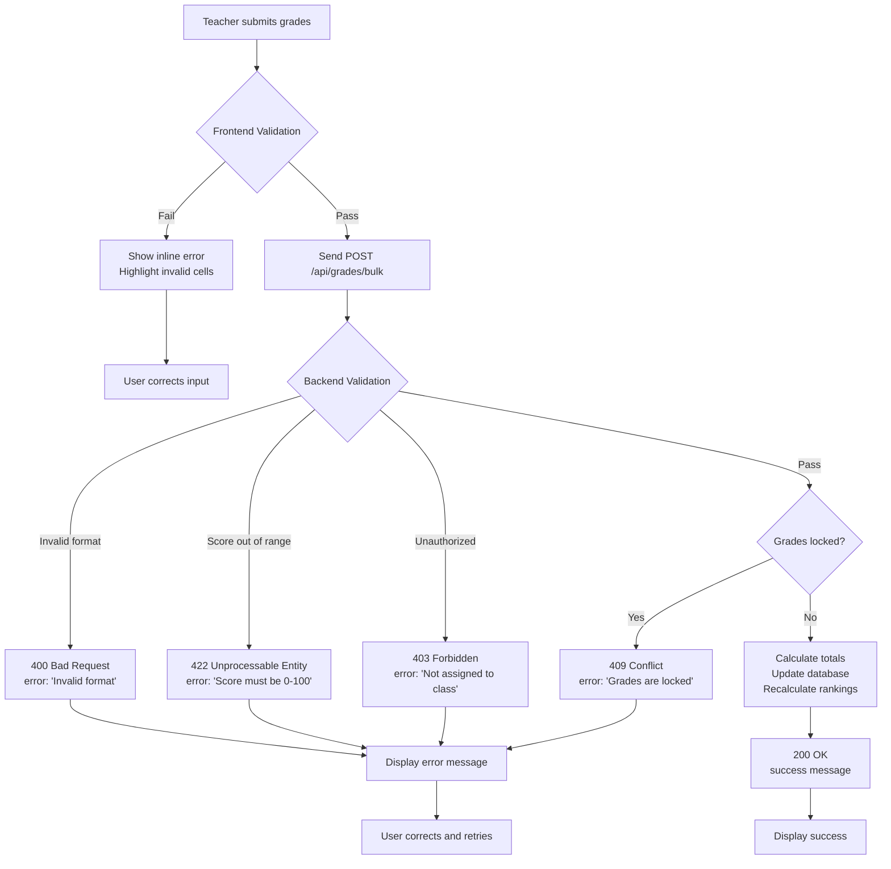

**Validation Rules:**

| Field | Rule | Error Message |
|-------|------|---------------|
| **CA Score** | 0 ≤ score ≤ 100 | "CA score must be between 0 and 100" |
| **Exam Score** | 0 ≤ score ≤ 100 | "Exam score must be between 0 and 100" |
| **Student ID** | Must exist in class | "Invalid student ID" |
| **Subject ID** | Must be assigned to class | "Subject not assigned to this class" |
| **Term ID** | Must be valid and active | "Invalid or inactive term" |
| **Locked Status** | is_locked = false | "Grades are locked for this term" |
| **Permission** | Teacher assigned to class | "You are not assigned to teach this class" |

---

## 8. Caching Strategy & Data Freshness

### 8.1 Cache Layers

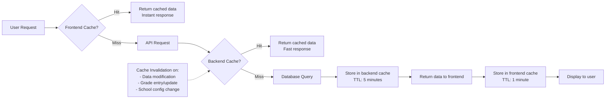

**Cached Data Types:**

| Data Type | Cache Duration | Invalidation Trigger |
|-----------|----------------|---------------------|
| **School Profile** | 1 hour | Admin updates school info |
| **Class List** | 5 minutes | New class added |
| **Subject List** | 5 minutes | New subject added |
| **Grading Scales** | 15 minutes | Grading config changed |
| **Student Grades** | No cache (always fresh) | Every grade entry |
| **Report URLs** | 1 hour | New report generated |
| **User Session** | 4 hours | Logout or token expiration |

---

## 9. Concurrency Handling

### 9.1 Multiple Teachers Entering Grades Simultaneously

**Scenario:** Two teachers enter grades for different subjects in the same class at the same time.

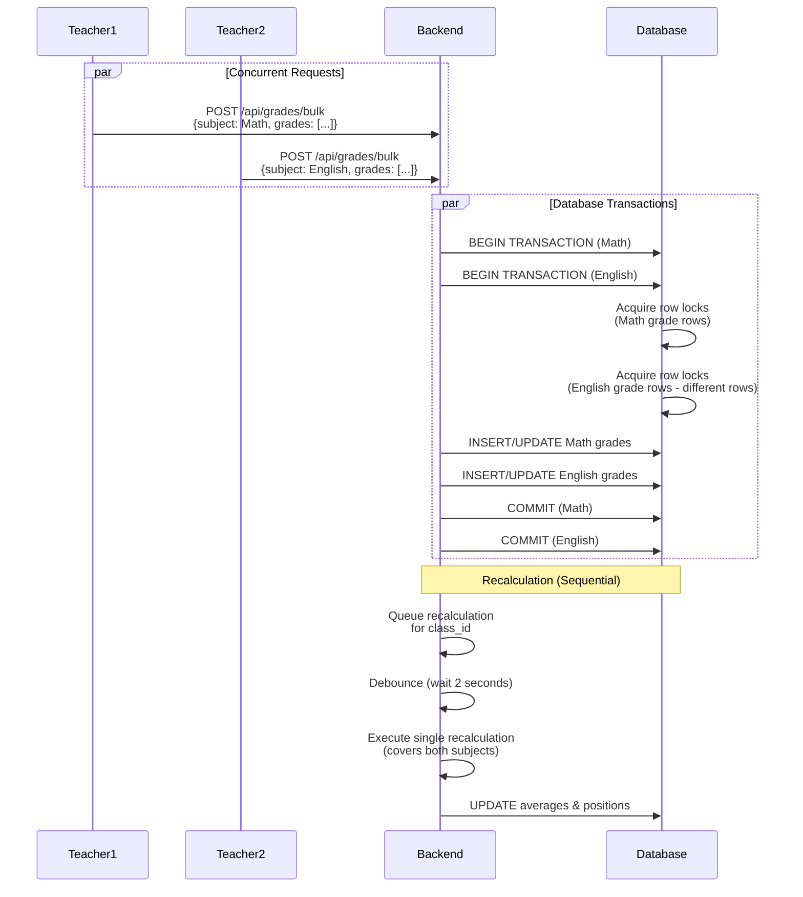

**Concurrency Strategy:**

1. **Row-level locking** - Database locks only affected grade rows
2. **Transaction isolation** - Each grade entry is a separate transaction
3. **Debounced recalculation** - Multiple updates trigger one recalculation
4. **No data conflicts** - Different subjects modify different rows

---

## 10. Summary of Critical Data Flows

| Flow | Trigger | Processing Time | Data Volume |
|------|---------|----------------|-------------|
| **Login** | User enters credentials | < 1 second | 1 user record |
| **School Setup** | Admin first-time config | 2-5 minutes | ~50 records |
| **Grade Entry** | Teacher submits form | 2-5 seconds | 40 student records |
| **Calculation** | After grade entry | 1-3 seconds | 40 student calculations |
| **Report Generation** | Admin triggers | 2-5 minutes | 40 PDFs (async) |
| **Result Viewing** | Student/Parent request | < 1 second | 10-50 grade records |
| **Historical Data** | User requests trends | 1-2 seconds | 100-500 records |

---

**Next Steps:**
1. Review data flow scenarios
2. Validate performance expectations
3. Document deployment boundaries
4. Proceed to Stage 7: Technical Specifications

---

**Status:** Ready for Review  
**Approver:** Product Owner, Technical Lead  
**Last Updated:** 2026-01-11
