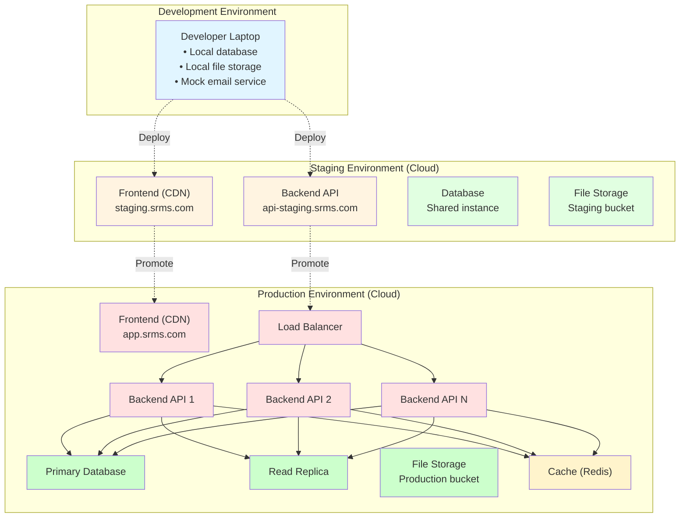
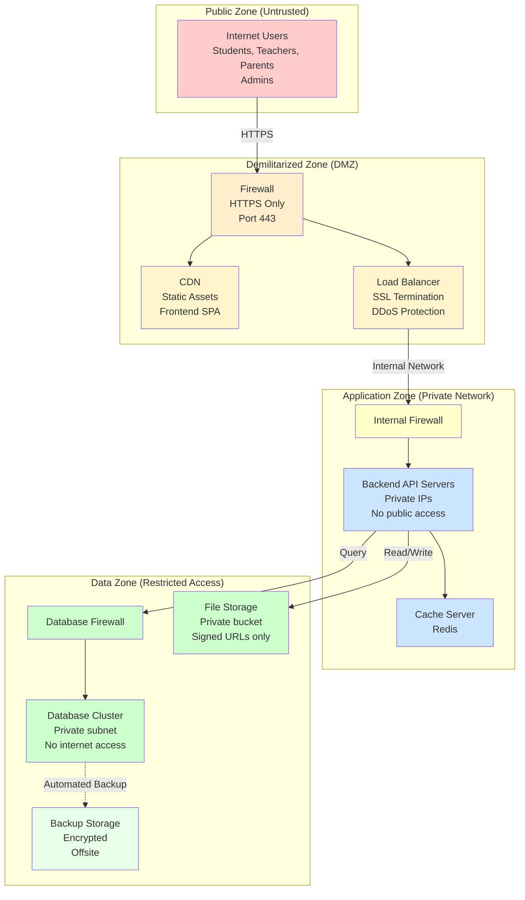
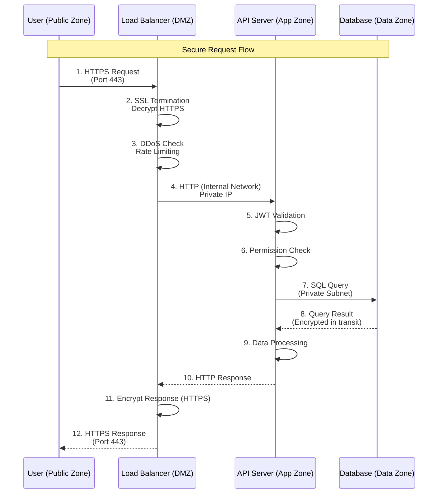
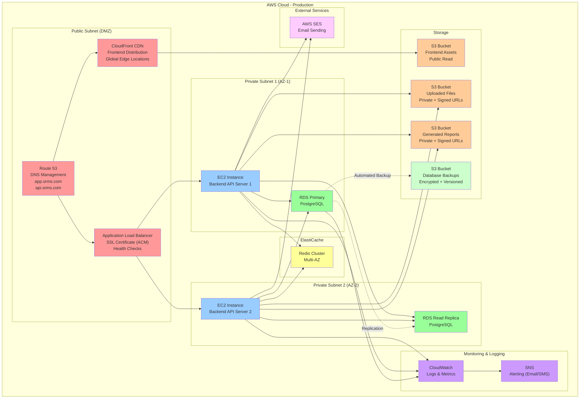
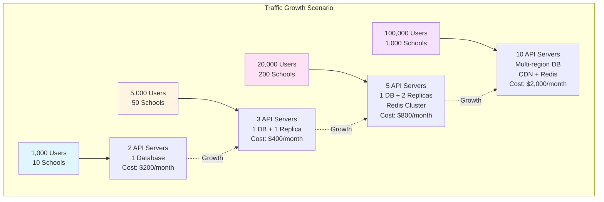
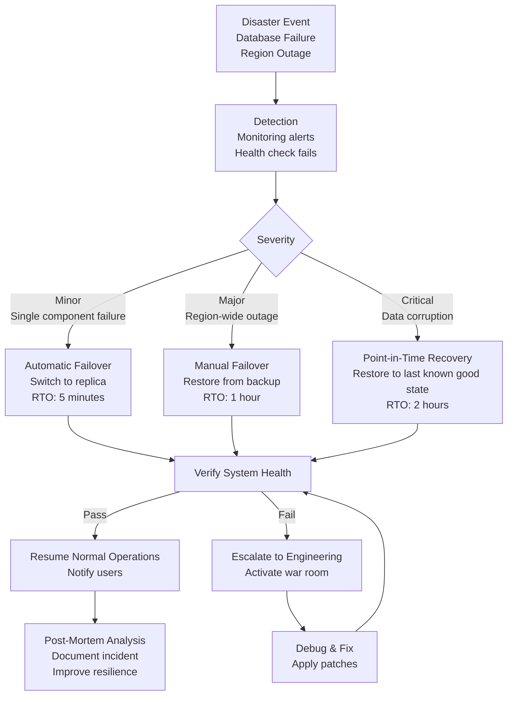
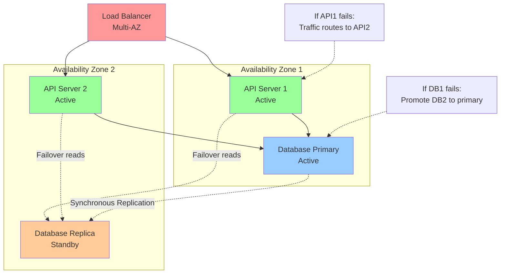
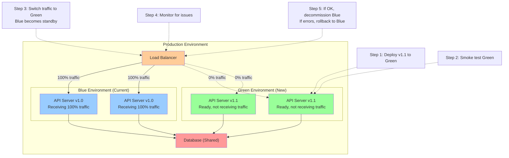

# Deployment Boundaries
# School Result Management System (SRMS)

**Version:** 1.0  
**Date:** 2026-01-11  
**Owner:** Software Architect  
**Status:** Draft

---

## Overview

This document defines the deployment boundaries, trust zones, environment configurations, and infrastructure requirements for SRMS. It outlines the separation between development, staging, and production environments, as well as security boundaries and scaling considerations.

---

## 1. Deployment Environments

### 1.1 Environment Types

---

### 1.2 Environment Characteristics

| Aspect | Development | Staging | Production |
|--------|-------------|---------|------------|
| **Purpose** | Local development & testing | Pre-production validation | Live system for users |
| **Location** | Developer machines | Cloud (shared resources) | Cloud (dedicated resources) |
| **Database** | SQLite or local PostgreSQL | Shared PostgreSQL | Dedicated PostgreSQL cluster |
| **Data** | Seed/dummy data | Anonymized production data | Real user data |
| **File Storage** | Local disk | Cloud bucket (staging) | Cloud bucket (production) |
| **Email** | Console logs or Mailtrap | Test email service (Mailtrap) | Live email service (SendGrid) |
| **Users** | Developers only | QA, stakeholders | Schools, teachers, students |
| **Uptime SLA** | None | None | 99.5% |
| **Backup** | None | Daily (7-day retention) | Hourly incremental, daily full (30-day retention) |
| **Monitoring** | Optional | Basic logging | Full monitoring & alerts |
| **SSL/TLS** | Optional (self-signed) | Yes (valid certificate) | Yes (valid certificate) |
| **Scaling** | N/A | Vertical only | Horizontal + vertical |
| **Cost** | Free (local) | Low (shared) | Variable (based on usage) |

---

## 2. Trust Zones & Security Boundaries

### 2.1 Network Security Zones

---

### 2.2 Access Control Matrix

| Zone | Who Can Access | How | Restrictions |
|------|----------------|-----|--------------|
| **Public Zone** | Anyone on the internet | Web browser | Rate limiting, CAPTCHA on login |
| **DMZ** | Public via HTTPS | HTTPS only | DDoS protection, WAF rules |
| **Application Zone** | Load balancer only | Internal network | No direct public access |
| **Data Zone** | API servers only | Private subnet | IP whitelist, no internet gateway |
| **Backup Storage** | Automated backup service | Encrypted connection | Read-only for disaster recovery |

---

### 2.3 Data Flow Across Trust Zones

**Security Measures:**

1. **TLS Encryption** - All public traffic encrypted (HTTPS)
2. **Private Subnets** - Database not accessible from internet
3. **JWT Validation** - Every API request requires valid token
4. **IP Whitelisting** - Database only accepts connections from API servers
5. **Principle of Least Privilege** - Each component has minimal permissions

---

## 3. Infrastructure Components

### 3.1 Production Infrastructure (AWS Example)

---

### 3.2 Component Specifications (Production)

| Component | Technology | Quantity | Specifications | Purpose |
|-----------|-----------|----------|----------------|---------|
| **Frontend Hosting** | CloudFront + S3 | 1 distribution | Global CDN | Serve SPA assets |
| **Load Balancer** | AWS ALB | 1 | Multi-AZ, SSL termination | Route traffic, health checks |
| **API Servers** | EC2 (or containers) | 2-5 (auto-scale) | t3.medium (2 vCPU, 4GB RAM) | Run backend application |
| **Database** | RDS PostgreSQL | 1 primary + 1 replica | db.t3.medium (2 vCPU, 4GB RAM, 100GB SSD) | Store application data |
| **Cache** | ElastiCache Redis | 1 cluster | cache.t3.micro (1 node) | Cache frequently accessed data |
| **File Storage** | S3 | 3 buckets | Standard storage class | Frontend, files, reports |
| **Backup Storage** | S3 | 1 bucket | S3 Glacier for long-term | Automated database backups |
| **Email Service** | AWS SES | 1 account | Pay per email | Send transactional emails |
| **Monitoring** | CloudWatch | 1 | Logs, metrics, alarms | Monitor system health |
| **DNS** | Route 53 | 1 hosted zone | Low latency routing | Domain management |

---

### 3.3 Alternative Cloud Providers

**Azure Equivalent:**

| AWS | Azure |
|-----|-------|
| CloudFront | Azure CDN |
| ALB | Application Gateway |
| EC2 | Virtual Machines / App Service |
| RDS PostgreSQL | Azure Database for PostgreSQL |
| ElastiCache | Azure Cache for Redis |
| S3 | Blob Storage |
| SES | SendGrid (marketplace) |
| CloudWatch | Azure Monitor |
| Route 53 | Azure DNS |

**GCP Equivalent:**

| AWS | GCP |
|-----|-----|
| CloudFront | Cloud CDN |
| ALB | Cloud Load Balancing |
| EC2 | Compute Engine / Cloud Run |
| RDS PostgreSQL | Cloud SQL for PostgreSQL |
| ElastiCache | Memorystore for Redis |
| S3 | Cloud Storage |
| SES | SendGrid (partner) |
| CloudWatch | Cloud Monitoring |
| Route 53 | Cloud DNS |

---

## 4. Scaling Strategy

### 4.1 Horizontal Scaling (Production)

---

### 4.2 Auto-Scaling Configuration

**Frontend:** No scaling needed (CDN handles unlimited traffic)

**Backend API Servers:**

| Metric | Threshold | Action |
|--------|-----------|--------|
| **CPU Utilization** | > 70% for 5 minutes | Add 1 instance |
| **CPU Utilization** | < 30% for 10 minutes | Remove 1 instance |
| **Request Count** | > 1,000 req/sec | Add 1 instance |
| **Min Instances** | 2 (high availability) | Always running |
| **Max Instances** | 10 (cost control) | Hard limit |
| **Cooldown Period** | 5 minutes | Between scaling events |

**Database:**

| Metric | Threshold | Action |
|--------|-----------|--------|
| **CPU Utilization** | > 80% for 10 minutes | Upgrade instance type (vertical) |
| **Storage** | > 80% full | Increase storage capacity |
| **Read Load** | > 1,000 queries/sec | Add read replica |
| **Connection Count** | > 80% of max | Optimize queries or add read replica |

---

### 4.3 Performance Targets by Scale

| Scale | Schools | Students | Concurrent Users | Response Time | Uptime SLA |
|-------|---------|----------|------------------|---------------|------------|
| **MVP** | 1-10 | < 5,000 | 50 | < 2 sec | 99% |
| **Growth** | 10-100 | 5,000-50,000 | 500 | < 1 sec | 99.5% |
| **Scale** | 100-500 | 50,000-250,000 | 2,500 | < 1 sec | 99.9% |
| **Enterprise** | 500+ | 250,000+ | 10,000+ | < 500ms | 99.95% |

---

## 5. Disaster Recovery & Business Continuity

### 5.1 Backup Strategy

**Database Backups:**

| Type | Frequency | Retention | Storage |
|------|-----------|-----------|---------|
| **Incremental** | Every 6 hours | 7 days | S3 Standard |
| **Full Backup** | Daily at 2 AM UTC | 30 days | S3 Standard |
| **Weekly Snapshot** | Sunday 2 AM UTC | 90 days | S3 Glacier |
| **Point-in-Time Recovery** | Continuous (5-minute granularity) | 7 days | RDS automated |

**File Storage Backups:**

| Type | Frequency | Retention | Storage |
|------|-----------|-----------|---------|
| **Versioning** | On every file change | 30 versions | S3 Versioning |
| **Cross-Region Replication** | Continuous | Indefinite | S3 (DR region) |

---

### 5.2 Disaster Recovery Plan

**Recovery Objectives:**

| Scenario | RTO (Recovery Time Objective) | RPO (Recovery Point Objective) |
|----------|-------------------------------|-------------------------------|
| **Single API server failure** | < 1 minute (auto failover) | 0 (no data loss) |
| **Database replica failure** | < 5 minutes (automatic) | 0 (no data loss) |
| **Database primary failure** | < 10 minutes (promote replica) | < 5 minutes |
| **Region-wide outage** | < 1 hour (restore from backup) | < 1 hour (hourly backups) |
| **Data corruption** | < 2 hours (point-in-time recovery) | < 5 minutes (transaction logs) |
| **Complete data loss** | < 4 hours (restore from offsite backup) | < 24 hours (daily backups) |

---

### 5.3 High Availability Architecture

**High Availability Features:**

✅ **Multi-AZ Deployment** - Resources distributed across availability zones  
✅ **Load Balancer Health Checks** - Automatically route traffic away from failed servers  
✅ **Database Replication** - Synchronous replication for zero data loss  
✅ **Automated Failover** - RDS automatically promotes replica if primary fails  
✅ **Redundant API Servers** - Minimum 2 servers always running  
✅ **CDN Edge Caching** - Frontend remains available even if backend is down (cached content)

---

## 6. Deployment Process (CI/CD)

### 6.1 Continuous Integration & Deployment Pipeline

```mermaid
flowchart LR
    subgraph "Development"
        Dev[Developer<br/>Commits Code] --> Git[Git Push<br/>to GitHub]
    end
    
    subgraph "CI Pipeline (GitHub Actions)"
        Git --> Test[Run Tests<br/>Unit + Integration]
        Test --> Lint[Linting<br/>Code Quality]
        Lint --> Build[Build Artifacts<br/>Frontend + Backend]
        Build --> ScanSec[Security Scan<br/>Dependencies]
    end
    
    subgraph "Staging Deployment"
        ScanSec --> DeployStaging[Deploy to Staging<br/>Automated]
        DeployStaging --> E2E[E2E Tests<br/>Automated]
        E2E --> ManualQA[Manual QA<br/>Stakeholder Review]
    end
    
    subgraph "Production Deployment"
        ManualQA -->|Approve| DeployProd[Deploy to Production<br/>Blue-Green]
        DeployProd --> SmokeTest[Smoke Tests<br/>Health Checks]
        SmokeTest --> Monitor[Monitor Metrics<br/>for 1 hour]
    end
    
    Monitor -->|Success| Done[Deployment Complete]
    Monitor -->|Errors Detected| Rollback[Automatic Rollback<br/>to Previous Version]
    Rollback --> Alert[Alert DevOps Team]
    
    style Dev fill:#e1f5ff
    style Test fill:#fff4e1
    style Lint fill:#fff4e1
    style Build fill:#fff4e1
    style DeployStaging fill:#ffe1f5
    style DeployProd fill:#ffcccc
    style Rollback fill:#ff9999
    style Done fill:#99ff99
```

---

### 6.2 Deployment Boundaries by Component

| Component | Development | Staging | Production |
|-----------|-------------|---------|------------|
| **Frontend SPA** | Local dev server (`npm run dev`) | S3 + CloudFront (staging subdomain) | S3 + CloudFront (production domain) |
| **Backend API** | Local process (`npm start`) | Single EC2 instance | Auto-scaled EC2 instances behind ALB |
| **Database** | Local PostgreSQL or SQLite | Shared RDS instance | Dedicated RDS with replica |
| **File Storage** | Local file system | S3 bucket (staging prefix) | S3 buckets (production, isolated) |
| **Email Service** | Console logs | Mailtrap (test inbox) | AWS SES (live sending) |
| **Domain** | localhost:3000 | staging.srms.com | app.srms.com |

---

### 6.3 Blue-Green Deployment Strategy

**Deployment Steps:**

1. **Deploy to Green** - Deploy new version to green environment (zero downtime)
2. **Health Check** - Verify green environment is healthy
3. **Smoke Test** - Run automated smoke tests against green
4. **Traffic Switch** - Load balancer routes 100% traffic to green
5. **Monitor** - Watch metrics for 1 hour
6. **Rollback or Commit** - If errors, switch back to blue; if OK, decommission blue

**Rollback Time:** < 1 minute (instant traffic switch)

---

## 7. Security Boundaries

### 7.1 Defense in Depth

```mermaid
graph TB
    subgraph "Layer 1: Perimeter Security"
        WAF["Web Application Firewall<br/>• SQL injection protection<br/>• XSS protection<br/>• Rate limiting"]
        DDoS["DDoS Protection<br/>• AWS Shield<br/>• Rate limiting"]
    end
    
    subgraph "Layer 2: Network Security"
        VPC["Virtual Private Cloud<br/>• Private subnets<br/>• Network ACLs<br/>• Security groups"]
        Firewall["Firewalls<br/>• Port restrictions<br/>• IP whitelisting"]
    end
    
    subgraph "Layer 3: Application Security"
        Auth["Authentication<br/>• JWT tokens<br/>• Password hashing<br/>• MFA (future)"]
        RBAC["Authorization<br/>• Role-based access<br/>• Tenant isolation<br/>• Permission checks"]
    end
    
    subgraph "Layer 4: Data Security"
        Encryption["Encryption<br/>• TLS in transit<br/>• AES-256 at rest<br/>• Encrypted backups"]
        Audit["Audit Logging<br/>• All data modifications<br/>• Login attempts<br/>• Admin actions"]
    end
    
    subgraph "Layer 5: Monitoring & Response"
        Monitor["Monitoring<br/>• CloudWatch<br/>• Security alerts<br/>• Anomaly detection"]
        Incident["Incident Response<br/>• Alert escalation<br/>• War room procedures<br/>• Post-mortem analysis"]
    end
    
    User[Internet User] --> WAF
    WAF --> DDoS
    DDoS --> VPC
    VPC --> Firewall
    Firewall --> Auth
    Auth --> RBAC
    RBAC --> Encryption
    Encryption --> Audit
    Audit --> Monitor
    Monitor --> Incident
    
    style WAF fill:#ffcccc
    style DDoS fill:#ffcccc
    style VPC fill:#ffe6cc
    style Firewall fill:#ffe6cc
    style Auth fill:#ffffcc
    style RBAC fill:#ffffcc
    style Encryption fill:#ccffcc
    style Audit fill:#ccffcc
    style Monitor fill:#cce6ff
    style Incident fill:#cce6ff
```

---

### 7.2 Compliance & Data Privacy

**Data Residency:**

| Data Type | Storage Location | Compliance |
|-----------|------------------|------------|
| **User Data** | AWS region (configurable) | GDPR, local data protection laws |
| **Student Records** | Primary database (encrypted) | FERPA (US), GDPR (EU) |
| **Backup Data** | Offsite storage (encrypted) | Same as primary |
| **Logs** | CloudWatch (region-specific) | Retain for 90 days, then archive |

**Encryption Standards:**

- **In Transit:** TLS 1.3 (minimum TLS 1.2)
- **At Rest:** AES-256 encryption
- **Backups:** Encrypted before upload
- **Passwords:** bcrypt (cost factor 12)
- **JWT Secrets:** Rotated every 90 days

---

## 8. Cost Estimation (Monthly)

### 8.1 Infrastructure Costs (AWS, Production)

| Component | Specification | Monthly Cost (USD) |
|-----------|--------------|-------------------|
| **Frontend Hosting** | CloudFront + S3 (100GB transfer) | $15 |
| **Load Balancer** | ALB (2 AZs, 1M requests) | $25 |
| **API Servers** | 2 × t3.medium (730 hours) | $60 |
| **Database** | db.t3.medium (primary + replica) | $120 |
| **Cache** | ElastiCache t3.micro | $12 |
| **File Storage** | S3 Standard (50GB) | $1.50 |
| **Backup Storage** | S3 Glacier (200GB) | $1 |
| **Email Service** | SES (10,000 emails) | $1 |
| **Monitoring** | CloudWatch logs & metrics | $10 |
| **Domain & SSL** | Route 53 + ACM certificate | $1 |
| **Data Transfer** | 100GB outbound | $9 |
| **Total (Base)** | 10 schools, 5,000 students | **~$255/month** |

**Scaling Costs:**

| Scale | Schools | API Servers | Database | Total Cost/Month |
|-------|---------|-------------|----------|------------------|
| **MVP (10 schools)** | 10 | 2 × t3.medium | db.t3.medium | $255 |
| **Growth (50 schools)** | 50 | 3 × t3.large | db.t3.large | $450 |
| **Scale (200 schools)** | 200 | 5 × t3.large | db.r5.large + replica | $850 |
| **Enterprise (1000 schools)** | 1000 | 10 × t3.xlarge | db.r5.xlarge + 2 replicas | $2,500 |

---

## 9. Summary of Deployment Boundaries

| Boundary Type | Development | Staging | Production |
|---------------|-------------|---------|------------|
| **Physical Location** | Local machine | Cloud (shared) | Cloud (isolated) |
| **Network** | Localhost | Private VPC | Multi-AZ VPC |
| **Database** | Local instance | Shared RDS | Dedicated RDS cluster |
| **File Storage** | Local disk | S3 (staging bucket) | S3 (production buckets) |
| **Security** | Minimal | Basic (HTTPS) | Full (WAF, DDoS, encryption) |
| **Monitoring** | None | Basic logging | Full monitoring + alerts |
| **Backup** | None | Daily | Hourly incremental + daily full |
| **Uptime SLA** | None | None | 99.5% |
| **Scaling** | N/A | Vertical only | Horizontal + vertical |
| **Cost** | Free | ~$50/month | $255-$2,500/month |

---

**Next Steps:**
1. Review deployment boundaries and infrastructure plan
2. Approve cloud provider selection (AWS/Azure/GCP)
3. Approve disaster recovery and backup strategy
4. Proceed to Stage 7: Technical Specifications (select specific frameworks and tools)

---

**Status:** Ready for Review  
**Approver:** Product Owner, CTO, DevOps Lead  
**Last Updated:** 2026-01-11
