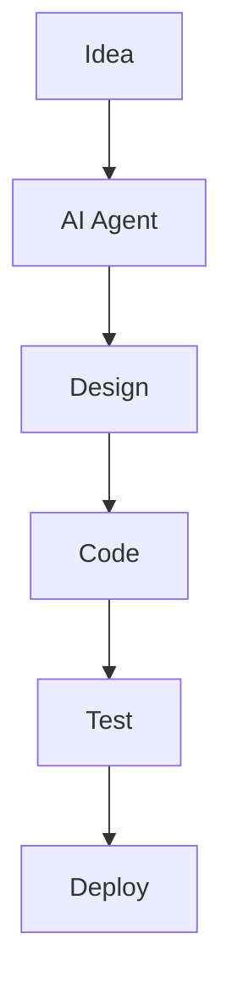

This skill is for creating Mermaid images.

Node.js and pnpm must be installed first.

pnpm add -g @mermaid-js/mermaid-cli
mmdc --version

Example diagram file: `diagram.mmd`

Generate SVG:
`mmdc -i diagram.mmd -o diagram.svg`
